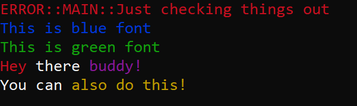
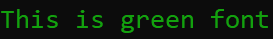

<p align="center"></p>

<h4 align="center">Windows Console Text Coloring Header-Only Helper Library</p>

[](http://unlicense.org/)
[]()

---

---

## Purpose

<p align="center"></p>

When creating large Windows-targetted projects I was constantly frustrated when trying to examine everything that was being printed to the console, without color it was difficult to accent or seperate data.

That led to the development of this simple *Console Colorizer* library! With this tiny header file you can start printing colored font to your console in no time!

---

## Feature Overview

To ensure ease of use with this library, I have primarily targeted using Pre-processor Macros to handle things. Alternatively, you can also use the ColorText class to store colored strings for re-use or simply inline them into ostreams.

### Color Blocks of Text
``` c++
// Setting the console text color in a block can be done with macros!
SET_FONT_COLOR(FONT_GREEN);

std::cout << "This is green font" << std::endl;

// This restores the color to white
RESET_CONSOLE_FONT();
```

<p align="center"></p>

### Print Red Warnings

``` c++
WRITE_CONSOLE_ERROR("MAIN", "Just checking things out");
```

<p align="center"></p>

### Print Inline Colored Text

``` c++
ColorText cTest("You can", FONT_BLUE);
std::cout << cTest << INLINE_COLOR_FONT(" also do this, ", FONT_BROWN) << ColorText("too!\n", FONT_CYAN);
```

<p align="center"></p>

---

## How To Use

1. Clone this repository
2. Next, drop the consoleColorer.h file into your project and add `#include "consoleColorer.h"` to your desired file to link the library.
3. If you don't want to use the ColorText class then you can disable it by going into the `consoleColorer.h` file and change `USING_COLOR_TEXT` to `false`

---

## Support

If you are looking for support please send a non-spammy looking email to Rilliden@gmail.com. If you are unsure what to write for the title, try something in this format:

```
[Repository Name] <Question>
```

---

## Q&A

### _Q_: Why make it header-only?

**A**: In keeping with the light-weight theme, it only felt right. This is a very small library and being able to avoid compiling and packaging for different systems is a great advantage. Do note that header-only libraries can slow down compile times, but that is also fairly irrelevant given the size.

### _Q_: Will you continue developing this library?

**A**: I plan to further develop this library as I find things I dislike about it or feel I could improve. On that note, I think there are definitely ways I could make this code more efficient.
